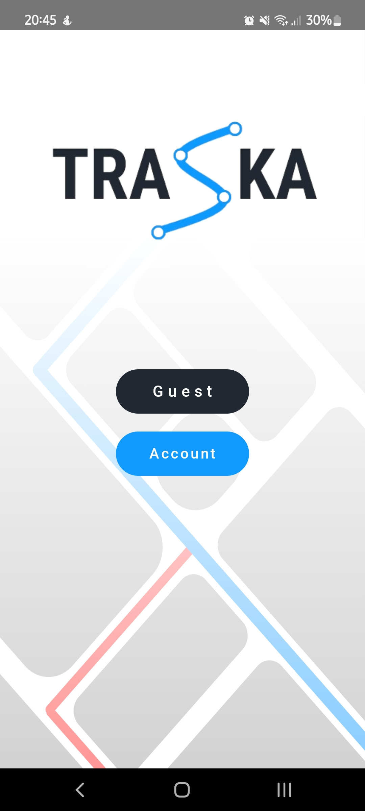

# TraSka 📍

Android app for waypoints optimization between origin and destination. With Firebase stored data and Google Cloud APIs (Places API, Directions API, Google Maps API)

## 📱 Screenshots

  
  
  

*From left: Main screen, Route planning, Optimized route visualization*

## 🛠️ Technologies Used

- **Kotlin** - Modern Android development
- **Jetpack Compose** - Declarative UI framework
- **Firebase** - Backend services and data storage
- **Google Cloud Platform** - Cloud infrastructure
- **Google Maps Platform APIs** - Directions API, Places API for accurate routing

## ✨ Key Features

- 🎯 Optimized routing between multiple waypoints to minimize travel time and distance
- 🗺️ Integration with various Google Maps Platform APIs for accurate and efficient route calculation
- 🎨 User-friendly interface built with Jetpack Compose
- 💾 Cloud-based data synchronization with Firebase
- 📍 Smart location search with Google Places API
